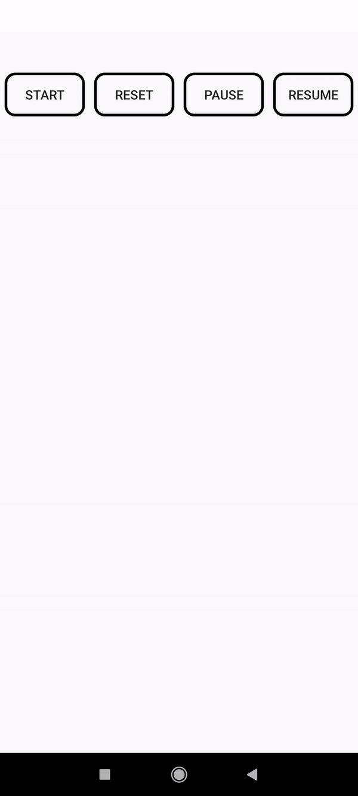

# Clock Timmer 
[](https://www.android.com)
[](https://android-arsenal.com/api?level=16s)
 
 Clock timmer is an Android library that can be used to make text timmer , with the use of interpolators, typefaces and more customisations.

# Usage
Add it in your root build.gradle at the end of repositories:
```
allprojects {
		repositories {
			...
			maven { url 'https://jitpack.io' }
		}
	}
  ```
  
Add the dependency
```
dependencies {
	        implementation 'com.github.shamithshetty:TextClock:Tag'
	}
  ```
  
## Example Usage 1 (Simple)
### XML

```
 <com.example.textclock2.TextClock
        android:id="@+id/txt"
        app:typeReverse="true"
        app:seconds="200"
        app:clockTextColor="#e20c0c"
        app:clockBorderWidth="6"
        app:clockBorderColor="#8d0bf7"
        android:layout_width="wrap_content"
        android:textSize="40dp"
        android:layout_height="wrap_content"
        android:layout_centerInParent="true"/>

```
### Demo with border width 6

<div align="center"></div>

### Java

```

textClock.startClock();  is used to start timmer. we can use inside onCreate or button click event.
text.resetClock();   is used to reset the timmer
textClock.pauseClock();  is used to pause the timmer
textClock.resumeClock(); is  used to resume the timmer 
  
```

###### Attr of XML
```
<declare-styleable name="Textview">
        <attr name="clockTextColor" format="color|reference"/>
        <attr name="clockBorderColor" format="color|reference"/>
        <attr name="clockBorderWidth" format="integer"/>
        <attr name="seconds" format="integer"/>
        <attr name="typeReverse" format="boolean"/>
    </declare-styleable>
```

###### License
This library is composed by other open source libraries, if used, must include all the license files.

```
Copyright 2020 shamith h shetty

Licensed under the Apache License, Version 2.0 (the "License");
you may not use this file except in compliance with the License.
You may obtain a copy of the License at

   http://www.apache.org/licenses/LICENSE-2.0

Unless required by applicable law or agreed to in writing, software
distributed under the License is distributed on an "AS IS" BASIS,
WITHOUT WARRANTIES OR CONDITIONS OF ANY KIND, either express or implied.
See the License for the specific language governing permissions and
limitations under the License.
```
